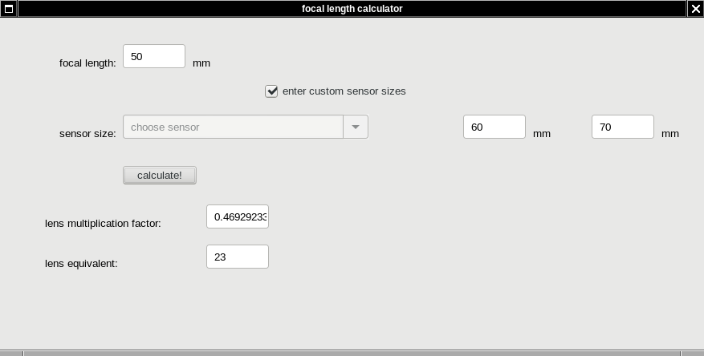
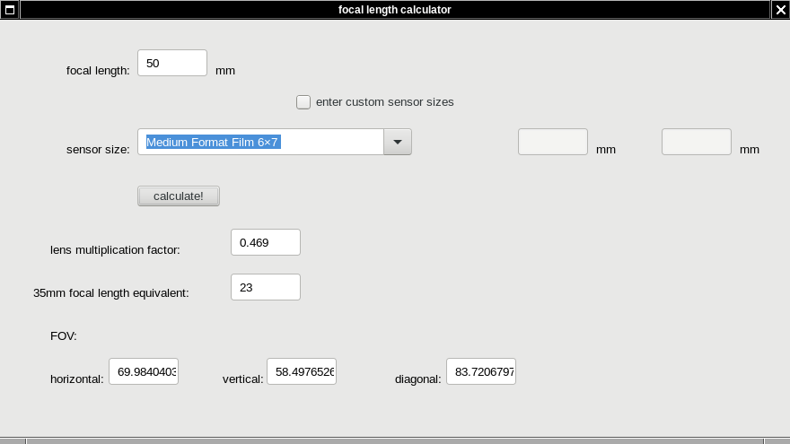

focal length equivalence calculator
=========

we are used to 'understand' how wide or narrow the FOV is by how many mm focal length of the lenses is.
however, our understanding is based on the presume that we have so called 'full frame' sensors, or 135 (24mmx36mm) film.

in case we have smaller sensors, as in many digital cameras, or we use medium format film cameras, understanding FOV or focal lengths is not as straightforward.

this utility helps to get the numbers we are used to (or focal length equivalence) given sensor size and actual focal length.

this image shows how i calculated equivalence for the 50mm lens I use with my Mamiya RB67, i. e. the frame area is 60mmx70mm. I see that FOV is roughly equivalent to the image i would get with 23mm lens on so called 'full frame' sensor.

update: now field of view calculations also work.

this image illustrates horizontal, vertical and diagonal field of view in degrees for given focal length and sensor.
